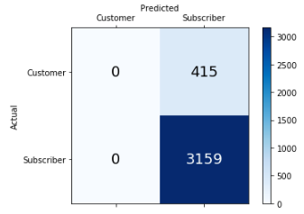

# Citibike Analysis

## Overview:
Cycling has become an increasingly significant part of the commuting routine for many New Yorkers. And a large portion of the cyclists in the city rely on Citibike to rent bicycles. According to the citibike business model citbike customers fall into two groups - full year subscribers or customers either using a day pay or a single ride pass. And that classification brings me to my question. 

## Question:
Can I use information about citibike riders such as age, gender, and start and stop station to determine whether they are renters or customers?

## Data:
The data used in my study originates from [Citibike system data](https://www.citibikenyc.com/system-data) and contained about 350,000 rows of data. 

Data used after dropping extraneous columns includes: trip duration (seconds), start time and date, stop time and date, start station name, end station name, station lat/long, user type (customer = 24-hour pass or 3-day pass user; subscriber = annual member), gender, birth year. 

## Feature Engineering:

First I took a random sample of 18,000 rows from the dataset to support API call limits. Then by parsing the start time and date columns I was able to add columns containing whether a rider started their ride in the morning (before 12), afternoon(between 12-6), or night(after 6). Additionally using the **Google Distance Matrix API** I calculated the distance between all riders start and stop stations to determine how far they were travelling in meters. The Google Distance Matrix API takes coordinates or location names and calculates the distance between them by the way of the road. 

When using the good distance matrix API I included an advaced critiria to spicify the mode of transport as by bicycle to give the highest level of accuracy because there are often times where cyclists travel on paths cars cannot use. 

Additionally looking at my data I saw there was a significant imbalance in my y dependent variable of usertype, so I used the Synthetic Minority Over-sampling Technique(SMOT) to generate a more balanced dataset.  

## Exploratory Data Analysis:

Looking at the data I can see that the riders age is normally distributed about 31 and there is a much larger proportion of subscribers to customers.

Subscribers vs customers prior to SMOT oversampling           |  Rider age distribution    
:-------------------------:|:-------------------------:
  | 

It can also be observed that most riders are not riding on the weekend and the most riders tend to happen in the morning. 

Biking day distribution              |  Biking time distribution    
:-------------------------:|:-------------------------:
  | 

Additionally, the most common arrival and edparture stations are both the Grve St. PATH station, with other stations receiving 1000 riders and descending.

## Modeling

Models     |  ACC |  Prec  | Recall  | F1  | AUC
:----------:|:-----------:|:-------------:|:-----------:|:---------:|:---------------:
Dummy     |  80.02 |  88.26  | 89.26  | .887  | .496  
SMOTE Dummy     |  50.44 |  88.72  | 50.33  | .64  | .511  
Random Forest     |  88.38 |  88.38  | 100  | .93  | .5  
SMOTE Random Forest     |  88.30 |  88.37  | 99.90  | .93  | .5  
XGBoost     |  88.30 |  88.37  | 99.90  | .93  | .499  
SMOTE XGBoost     |  77.72 |  88.49  | 85.97  | .87  | .504  
Logistic Regression     |  88.38 |  88.38  | 100  | .93  | .5  
SMOTE Logistic Regression     |  80.97 |  88.74  | 89.87  | .89  | .515  

Upon modeling the data it shows that the model, however, is not very effective given it possesses a low Area Under Curve(AUC) score. This indicates there may be some data leakage or another issue affecting the prediction. Applying SMOTE, however, proved effective with increasing the precision of the model, as precision is a measure of confidence in the true positives of th model.   
Logistic Regression Confusion Matrix  |  SMOTE Logistic Regression Confusion Matrix 
:----------:|:-----------:
 |  
